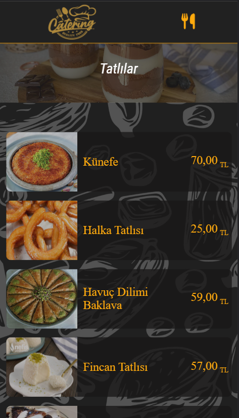
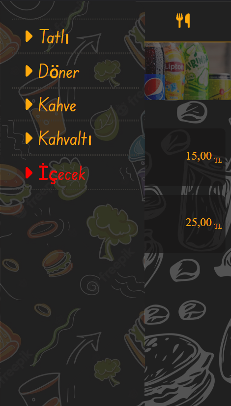

# QR MENU APP

## Description

This is a simple app that allows your customers to see your menu easily for your restaurant, bar, or cafe. So your customers can scan the QR code for the website and view your menu on their phones. This app is built with React.

You can take a look at the website [Click Here](https://qr-menu-9lub.onrender.com/).

## Screenshots




## Installation

To install necessary dependencies, run the following command:

```
npm install
```

## Usage

To run the app, run the following command:

```
npm run dev
```

or 

```
npm run host
```

## Contributing

If you would like to contribute, you can fork the repo and submit a pull request.
